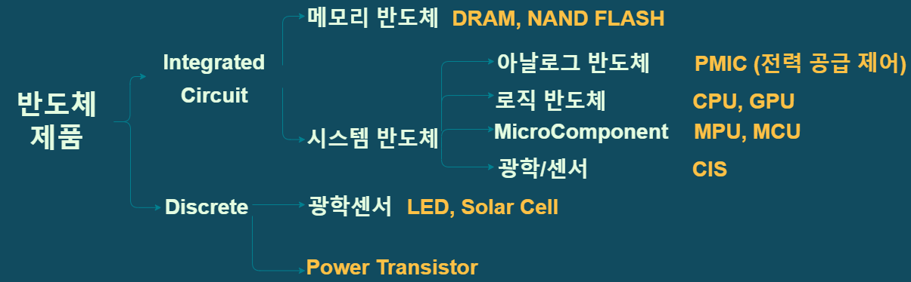

# 반도체 용어

## 💻 반도체란 ?

    1. 도체 : 전류가 잘 흐르는 물체
    2. 부도체 : 전류가 흐르지 않는 물체
    3. 반도체  : 사람의 의도에 따라 전류의 흐름을 **제어**하기에 적합

## 🔌 반도체 소자

    1. Transistor  : 신호 증폭 & 스위치 -> 고속 동작에 영향
    2. Capacitor : stores electricity
    3. Diode : valve for current flow

## 📺 반도체 제품

    반도체 소자를 조합하여 제작한 CPU 나 SSD 같은 제품

## 반도체 분류

반도체의 조립 형태, 역할, 세부역할에 따라서 다양한 제품이 존재

# 시스템 반도체

## 💾1. 로직 반도체

> 연산(계산), 판단, 명령 역할
> CPU, GPU, NPU, ASIC 등

- CPU : 여러 작업이 동시에 일어남 => **순차적**으로 여러 작업을 처리하는데 최적화
- GPU : 비교적 쉬운 문제를 한꺼번에 처리 => **병렬 연산**에 최적화

## 💾2. 아날로그 반도체

> Analog Signal -> Digital Signal

빛, 소리, 압력, 온도 등 자연계의 각종 아날로그 신호를 디지털 신호로 변환

- PMIC : 전자제품의 전력 공급 조절
  (i.e) 휴대폰 주변 밝기 조절, 저전력 대기 모드, 고속 충전, 과충전 방지
- DDI : 디스플레이의 화소 조절 => RGB 조절

## 💾3. 마이크로컴포넌트

> 소형화

- MCU : (== micro cpu) 연산 기능, 제어 기능
- MPU : (== micro controller) 컴퓨터를 소형화 한 것
  -> 전자 제품의 핵심 부분, 자동 제어 ,도난 방지 시스템
- SoC : MPU와 같이 하나의 성능을 가지는 여러 칩을 조립하여 시스템을 구현

# 메모리 반도체

반도체가 연산을 하기 위해서는, **많은 정보**를 필요로 한다.

### `메모리 반도체` : 필요한 정보를 미리 저장해둠

Cache memory에 저장하지만, 캐쉬 메모리에는 용량의 한계가 있기 때문에 `DRAM` 과 `FLASH MEMORY`에 저장한다. 이들은 캐시 메모리보다 느리지만 용량이 큰 기억장치다!

## 💾1. DRAM (Dynamic Random Access Memory)

컴퓨터가 작동하는 동안, 연산 소자를 필요하는 일이 많은 프로그램의 명령어와 자료를 저장한다 (i.e. loading, temporary save)

- 휘발성
  단시간에 필요한 정보 저장 (휘발성) - 컴퓨터가 켜저있고, 전원을 공급받을 때에만 저장됨 - 사용과 삭제를 반복하며 CPU의 연산을 돕는다

- DRAM CELL : Transistor + Capacitor + Controller

- 장점
  - 데이터 접근 쉬움
  - 결정 속도 빠름
  - 용량 적음

## 💾2. Flash Memory

보조 기억 장치로, 입력되는 자료와 처리 결과를 보관하고 연산 소자에 간헐적으로 필요로 하는 각종 프로그램 저장

- NAND FLASH MEMORY -> SSD, eMMC
- 처리속도는 DRAM보다 느리지만, 고전 보조 기억장치보다 빠르다

## 💾3. 광학/센서 반도체

CIS : CMOS 트랜지스터의 조합을 바탕으로 만들어짐

주변 환경 -> 시각 이미지화 => 정확도가 중요!!!

# 반도체 산업 용어 정리

| 산업                                 | 용어                                              |
| ------------------------------------ | ------------------------------------------------- |
| IDM ( Integrated Device Manufacture) | `전 과정` 진행                                    |
| 팹리스(Fabless)                      | `설계`만 담당                                     |
| 파운드리(Foundary)                   | `제조/생산`만 담당                                |
| OSAT                                 | 패키징, 검사/테스트 담당                          |
| 칩리스                               | 칩의 블록을 제공해주는 업체 \*\* (아래 설명 참고) |
| 디자인하우스                         | 팹리스의 도면 -> 레이아웃                         |

### 📝칩리스

팹리스 업체가, 칩의 기능과 크기가 증가하여 복잡도가 늘어나면서 담당하기가 버거워졌다.

Block : Chip 내에서 하나의 기능을 담당

이 block 을 제공해주는 업체를 칩리스라고 한다
