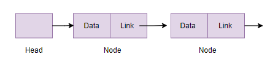

# 단일 연결리스트 구현

## Singly Linked List

<aside>
🔙 이전 페이지로 돌아가기: [LinkedList - 혜준](../LinkedList%208e337.md) 
Doubly LinkedList 구현:   [이중 연결 리스트 구현](%E1%84%8B%E1%85%B5%E1%84%8C%E1%85%AE%E1%86%BC%20%E1%84%8B%E1%85%A7%E1%86%AB%E1%84%80%20a5cb3.md) 
Circular LinkedList 구현 :  [원형 연결리스트 구현](%E1%84%8B%E1%85%AF%E1%86%AB%E1%84%92%E1%85%A7%E1%86%BC%20%E1%84%8B%E1%85%A7%E1%86%AB%2006fe8.md)

</aside>

### 기본 구조



```java
class LinkedList {
    Node head; 

    class Node {
        int data;
        Node next;

        Node(int d) { data = d; } //next 는 null 로 초기화
    }
}
```

### 맨 앞에 노드 추가

```java
// 맨 앞에 노드를 추가하는 코드 : 새로운 해드 생성
public void push(int new_data)
{
    Node new_node = new Node(new_data);
 
    new_node.next = head; //새 노드가 기존의 헤드를 가리키도록 해준다
 
    head = new_node;      //추가한 노드를 헤드로 지정한다
}
```


### 특정 노드뒤에 새로운 노드 추가

```java
//주어진 노드 뒤에 새 노드를 추가하는 구현이다
//이전 노드가 비어있으면 추가할 수 없다
public void insertAfter(Node prev_node, int new_data)
{
    if (prev_node == null) //비어있으면 추가 불가능
    {
        System.out.println("The given previous node cannot be null");
        return;
    }
 
    Node new_node = new Node(new_data);
 
    //ex: 1 _4(추가)_ 2 3 : 1이 2를 가리키고 있었다면, 4가 2를 가리키도록 해준다
    new_node.next = prev_node.next; //노드의 포인터가 이전노드가 가리키던 노드를 가리키게한다

		//ex: 1 _4(추가)_2 3 : 1은 기존에 2를 가리키고 있었지만, 4를 가리키도록 변경한다 
	  prev_node.next = new_node;      //이전 노드의 포인터가 새 노드를 가리키게 한다
}
```

'C', 'A', 'D' 를 원소로 갖고 있는 리스트의 두번째에 'B' 노드를 삽입할 때


### 맨 뒤에 새로운 노드 추가

```java
//맨 뒤에 추가
public void append(int new_data)
{
    Node new_node = new Node(new_data);
    Node last = head; //while 에서 쓰임 : 현재의 head를 지정

    if (head == null)  //리스트가 비어있다면 추가하려는 노드가 헤드가 된다
    {
        head = new Node(new_data);
        return;
    }
 
    new_node.next = null; //노드를 맨 마지막에 추가하려고 하기 때문에 포인터는 null을 가리키게 해준다
    //else 문 부분   
    while (last.next != null)  //헤드가 다음 노드를 가리킨다면
        last = last.next;      //last(처음에 head로 초기화)를 다음 노드로 설정->iterate 한다
 
    last.next = new_node; //마지막 노드가 새 노드를 가리키게 해준다
    return; //free the memory
}
```


### 노드 삭제

```java
//주어진 key를 삭제
void deleteNode(int key)
    {
        Node temp = head, prev = null; //head 저장
 
        if (temp != null && temp.data == key) { //노드가 head고 head 다음값이 존재할때
            head = temp.next; // 헤드를 다음 값으로 교체한다
            return;
        }
 
        while (temp != null && temp.data != key) { //iterate
            prev = temp;
            temp = temp.next;
        }
 
        if (temp == null) //리스트에 주어진 key가 없다 -> escape
            return;
 
        // ex: 1 2 3(삭제) 4 : 2의 포인터를 3이 기존에 가리키던 4를 가리키게한다
        prev.next = temp.next; //이전 노드의 포인터가 삭제할 포인터의 다음값을 가리키게한다
    }
```

위 코드에서, 삭제할 노드가 헤드일 경우  구현 설명:


```java
  if (temp != null && temp.data == key) { //노드가 head고 head 다음값이 존재할때
            head = temp.next; // 헤드를 다음 값으로 교체한다
            return;
        }
```

헤드가 아닌 부분- while loop 구현 설명: 


```java
        while (temp != null && temp.data != key) { //iterate
            prev = temp;
            temp = temp.next;
        }
 
        if (temp == null) //리스트에 주어진 key가 없다 -> escape
            return;
 
        // ex: 1 2 3(삭제) 4 : 2의 포인터를 3이 기존에 가리키던 4를 가리키게한다
        prev.next = temp.next; //이전 노드의 포인터가 삭제할 포인터의 다음값을 가리키게한다
```

소스 코드 참고: Geeks for Geeks